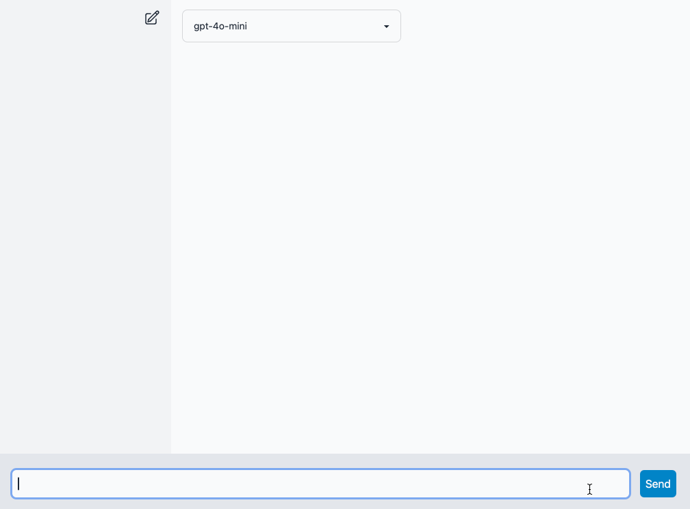

# pyview ai chat example

This is a quick example of a chatbot using [pyview](https://github.com/ogrodnek/pyview) and [openai](https://openai.com).

It's not production-ready, it's just a simple example to show how to use pyview and openai together in a chat interface. Currently chats are not persisted, and it doesn't keep a history.



## Running

This project uses [poetry](https://python-poetry.org/) for dependency management, and [just](https://github.com/casey/just) for task automation.

You need an OpenAI API key to run this project. You can get one [here](https://platform.openai.com/signup).

### Install dependencies

```bash
poetry install
```

### Set up environment variables

If using just, you can create a `.env` file with the following content:

```bash
OPENAI_API_KEY=your-api-key
```

or else just export the environment variable:

```bash
export OPEN_API_KEY=your-api-key
```

### Run the project

```bash
just
```
